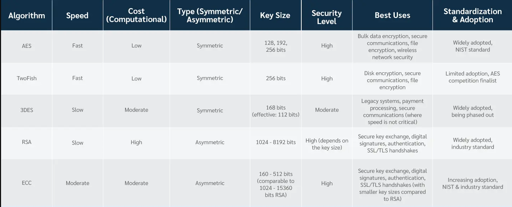

# VisualData-QualityAndSecurity

This project explores using Fourier Transform for screen detection to help improve the quality of visual data. 

It also provides an example of AES encryption for data security.

# Screen Detection

Detecting screens in an image using the Fast Fourier Transform (FFT) involves analyzing the frequency components of the image to identify patterns that might indicate the presence of a screen. While the provided sources primarily focus on blur detection using FFT, the underlying principles can be adapted for screen detection by analyzing the frequency domain for specific patterns that are characteristic of screens.

### DFT vs. FFT

The Discrete Fourier Transform (DFT) and the Fast Fourier Transform (FFT) are both mathematical operations used in signal processing, but they serve different purposes and have distinct characteristics.

Discrete Fourier Transform (DFT): The DFT is a mathematical operation that transforms a sequence of discrete points in the time domain into a sequence of discrete points in the frequency domain. It establishes a relationship between the time domain and frequency domain representation of a signal. The DFT is a discrete version of the Fourier Transform, which is used for continuous signals. The DFT is computationally intensive, with a time complexity of O(n^2), where n is the number of points in the sequence.

Fast Fourier Transform (FFT): The FFT is an efficient algorithm for computing the DFT. It is designed to perform the DFT in a significantly reduced amount of time compared to the direct computation of the DFT. The FFT achieves this efficiency by breaking down the DFT into smaller DFTs, which are then combined to obtain the final result. The FFT has a time complexity of O(n log n), which is a substantial improvement over the O(n^2) complexity of the DFT. This makes the FFT much faster for large sequences.

### White Screen Issue

Seeing a white screen after applying the Discrete Fourier Transform (DFT) and attempting to display the result is likely due to the dynamic range of the Fourier coefficients being too large for the display. This issue arises because the Fourier coefficients can have both very small and very large values, which when directly visualized, result in most of the image appearing white due to the high values being mapped to the maximum pixel value (255 for 8-bit images).

To address this issue, switch to a logarithmic scale for the magnitude spectrum of the Fourier transform. This scaling adjustment helps in visualizing the spectrum more effectively by reducing the dynamic range of the values, making it easier to observe both small and large changes in the frequency components of the image.

### Thresholding Reference for Future Work

Using cv2.IMREAD_GRAYSCALE to load an image into grayscale format is a good step for simplifying the image data, which can make subsequent processing tasks, such as thresholding, more straightforward. However, whether thresholding is needed depends on the specific characteristics of the image and the objective of an image processing pipeline.

Thresholding is particularly useful segmenting an image into foreground and background, or to highlight specific features within an image. It works by setting a threshold value that separates the pixels into two groups: those above the threshold and those below. This can be particularly useful for tasks like edge detection, to highlight the boundaries between different regions in an image.

Given a grayscale image, applying thresholding can help in several ways:

Simplifying the Image: Thresholding can simplify the image by reducing the number of grayscale levels to just two (black and white). This can make subsequent processing steps easier and more efficient.
Highlighting Features: To detect specific features in the image (like edges or text), thresholding can help by making these features more prominent.

Preparing for Further Processing: Thresholding can prepare an image for further processing steps, such as morphological operations or contour detection, by providing a binary image that is easier to work with.

##### Simple Thresholding
This method involves setting a fixed threshold value to convert the image to binary. All pixels with intensities above (or below) the threshold value are turned on, while all other pixels are turned off.

##### Adaptive Thresholding
Adaptive thresholding adjusts the threshold value locally, making it effective for varying lighting conditions. It's more suitable for complex backgrounds compared to global thresholding.

##### Otsu's Thresholding
Otsu's method automatically determines the optimal threshold value based on the image histogram, making it particularly useful for complex images.

### Classifier for Future Work
Building a Classifier for Screen Detection using the magnitude spectrum of the Fourier transform as features. Possible to train a machine learning model (e.g., SVM, Random Forest) on a dataset of images with and without screens to classify new images based on their frequency components.

# Image Encryption
Reference: [Data Security Blog](https://preyproject.com/blog/types-of-encryption-symmetric-or-asymmetric-rsa-or-aes#:~:text=When%20comparing%20AES%20vs.,key%20exchange%20and%20digital%20signatures.)

